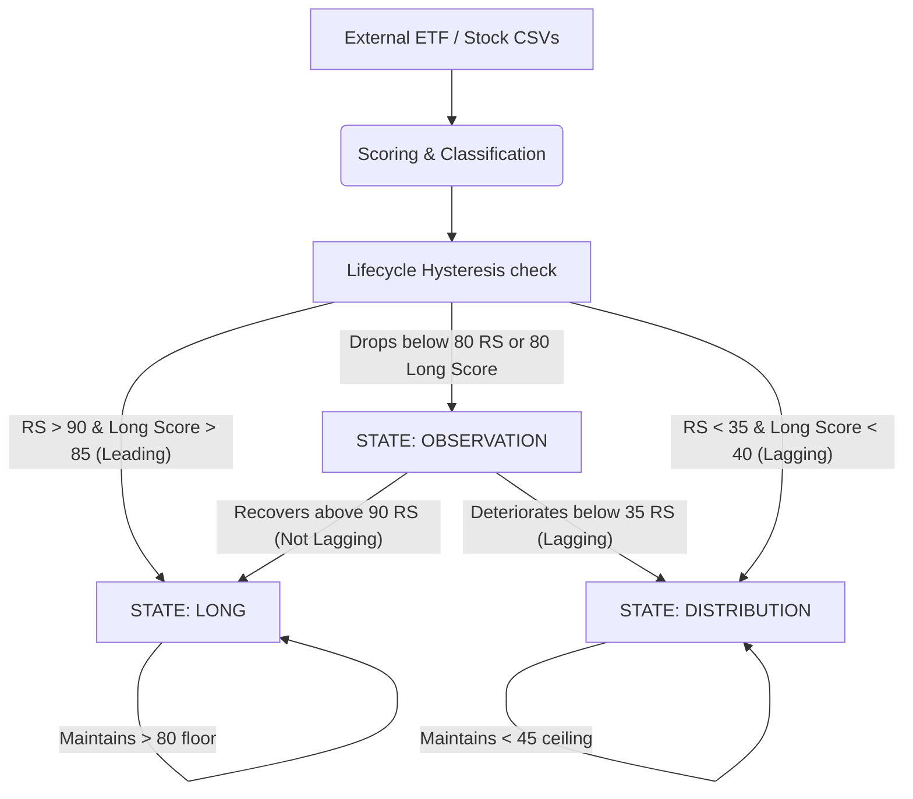

# TABELA Data Flow & Stock Lifecycle Architecture

> **Purpose:** This document maps the authoritative flow of a stock candidate throughout the TABELA Market Intelligence Platform. It outlines the precise triggers for promotion, hysteresis maintenance, demotion, and structural short-candidate tracking. The engine is deliberately **stateless**, meaning assignments are calculated fluidly based on real-time divergences rather than arbitrary countdown clocks.

## 1. System Data Flow Diagram

## 2. Definitive Lifecycle Breakdown: The Hysteresis Engine

TABELA manages whipsawing (rapidly flickering on/off lists due to daily noise) by implementing **Hysteresis**. This mimics professional trade management: entering a position requires pristine, A+ criteria, but holding a position utilizes a slightly wider "maintenance floor" to absorb healthy pullbacks.

### Phase 1: Entry into LONG (The Front Door)
A stock enters the `LONG` tracking state organically by qualifying as a top-tier candidate on any given trading day.
* **The Rule:** `Theme = Leading/Unc. Leader` AND `RS_Rating >= 90` AND `Long_Score >= 85`.
* **Action:** TABELA writes the stock into `registry.json` as `"LONG"`. 
* **If previously untracked:** It appears as a `NEW` long. If it previously lived in Observation, it is flagged as a `RECOVERED` long via a carrot prefix (e.g., `^WDC`).

### Phase 2: Sustaining LONG (Maintenance Floor)
Because highly-ranked stocks experience temporary daily pullbacks, TABELA provides a wider structural floor to prevent premature eviction from the LONG list.
* **The Rule:** If a stock was recorded as `"LONG"` yesterday, it is evaluated against the *Maintenance Threshold* today.
* **The Floor:** `RS_Rating >= 80` AND `Long_Score >= 80` AND `Theme IS NOT Lagging`.
* **The Action:** As long as the stock remains above this floor, it maintains its `"LONG"` identity.

### Phase 3: The OBSERVATION Tier (Divergence Purgatory)
The Observation tier acts as the system's "Divergence Engine". There are no "time limits" (e.g., previously 21 days); a stock stays here as long as its data tells a conflicting story. 
* **The Trigger:** If a LONG stock crashes through the 80/80 Maintenance Floor, it instantly downgrades to `OBSERVATION`. Conversely, if a DISTRIBUTION stock rallies above its ceiling, it floats up into `OBSERVATION`.
* **Why it matters:**
  * *Hidden Accumulation (Long setups):* The stock's Sector died (Lagging), but the stock still has a 95 RS. Institutions are holding it up. 
  * *Hidden Weakness (Short setups):* The stock's Sector is booming (Leading), but the stock has a 20 RS. The company is fundamentally broken relative to its peers.

### Phase 4: Entry into DISTRIBUTION (Structural Weakness)
The true Short tier. These are essentially structurally broken companies bleeding institutional capital amidst overarching macroeconomic headwinds.
* **The Rule:** `Theme = Lagging` AND `RS_Rating <= 35` AND `Long_Score <= 40`.
* **Action:** TABELA assigns it the `"DISTRIBUTION"` label. 

### Phase 5: Sustaining DISTRIBUTION 
Just like Longs, short setups require "room to breathe" (dead cat bounces).
* **The Ceiling:** If a stock was recorded as `"DISTRIBUTION"` yesterday, it maintains that status as long as `RS_Rating <= 45` AND `Long_Score <= 50` AND `Theme IS NOT Leading`.
* **The Action:** If the stock rallies powerfully through this ceiling, the short thesis is invalidated and the stock floats back to `OBSERVATION`.

## 3. Edge Cases

### Edge Case: Ghost Purge
* If a stock undergoes a corporate merger, de-listing, or ticker change and physically vanishes from the CSV snapshots, the transition engine drops it to `OBSERVATION` automatically in the interest of data safety, eventually decaying from the screen if it never reappears. 

### Edge Case: Sector Shock Protection
* If a stock is actively tracked in `DISTRIBUTION` (a prime short target) and its macro theme unexpectedly gaps up to `Leading`, the rule actively revokes its distribution status and bumps it to Observation. This strictly protects capital from being short in a freshly leading sector (a recipe for massive short-squeezes).
