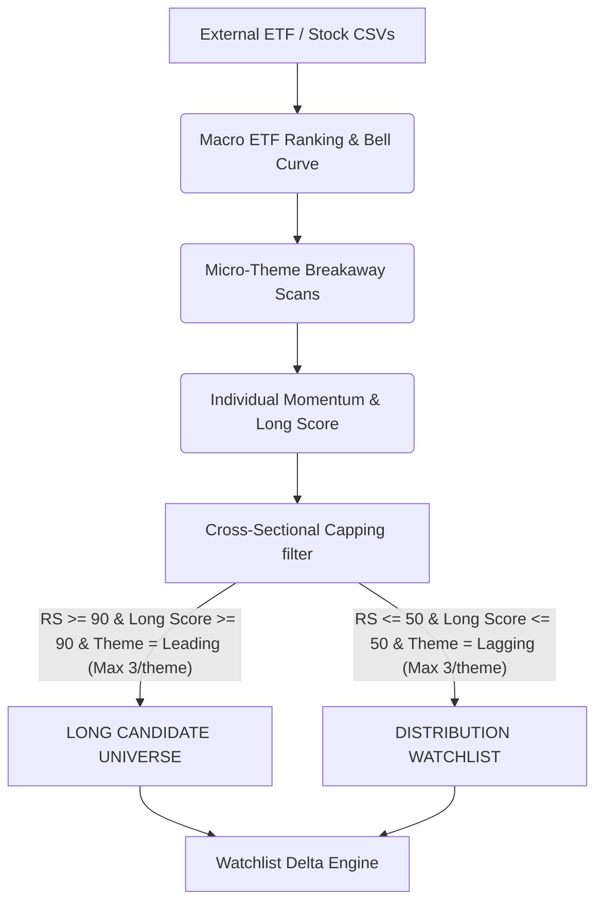

# TABELA Data Flow & Stock Lifecycle Architecture

> **Purpose:** This document maps the authoritative flow of a stock candidate throughout the TABELA Market Intelligence Platform. TABELA V2 is a **Stateless Cross-Sectional** engine. It does not utilize decaying "grace periods" or memory tracking. Instead, it acts as a ruthless daily filter, continuously extracting absolute alpha based purely on present-day statistical deviations (the 16/68/16 Bell Curve model) and enforcing strict per-theme limits.

## 1. System Data Flow Diagram

## 2. Definitive Lifecycle Breakdown: The Stateless Engine

TABELA manages whipsawing (rapidly flickering on/off lists due to daily noise) by implementing **strict mathematical purity**. Whipsaw is controlled purely by demanding absolute structural outperformance rather than forgiving underperformance with hysteresis.

### Phase 1: Macro-Theme Bell Curve (16/68/16)
The engine ranks all ~41 Macro ETF Themes to identify the underlying flow of institutional capital. 
* **Leading (Top 16%)**: The absolute most explosive 7 themes in the market.
* **Neutral (Middle 68%)**: The choppy, noisy, trendless middle. Fully ignored by TABELA.
* **Lagging (Bottom 16%)**: The absolute worst 7 themes experiencing catastrophic institutional selling.

### Phase 2: Micro-Theme Breakaway Override
The engine tracks over 250 underlying Micro-Themes (e.g., "Optical Networking", "Digital Assets"). 
* If a Micro-Theme organically calculates into the extreme **Top 5%** of all micro-themes in the market, it is tagged as a `Breakaway Leader`. 
* If a stock is in a Breakaway micro-theme, it actively ignores its parent Macro ETF's failure and is allowed to compete for Long slots regardless of Macro head-winds.

### Phase 3: The Cross-Sectional Draft (Longs)
To become a `LONG` candidate, a stock must be drafted in today's daily cross-section.
* **The Math:** `RS_Rating >= 90` AND `Long_Score >= 90`.
* **The Theme:** Must be mathematically `Leading` (Macro) OR `Breakaway Leader` (Micro).
* **The Cap:** It must rank sequentially in the **Top 3** highest Long Scores within its specific theme. If it is the 4th best stock, it is "Crowded Out."

### Phase 4: The Cross-Sectional Draft (Distribution)
The Distribution tier tracks structural breakdowns for short entry targets.
* **The Math:** `RS_Rating <= 50` AND `Long_Score <= 50`.
* **The Theme:** Must be mathematically `Lagging` (Macro) OR `Breakaway Laggard` (Micro).
* **The Cap:** It must rank sequentially in the **Absolute Worst 3** Long Scores within its specific theme.

## 3. The Delta Watchlist

Because the engine is perfectly stateless day-over-day, memory is handled purely at the presentation tier out of flat JSON snapshots.
* **Days on List:** The Delta Engine compares today's surviving draft picks against yesterday's file. It visually appends the continuous `Days` a stock has successfully survived the cross-sectional cut.
* **Dropped Details:** If a stock fails to make the draft limits (due to a Theme Downgrade, loss of RS, or simply getting Crowded Out by 3 better stocks), the Delta Engine dynamically extracts the exact metric it failed on and presents it in a daily Exit Log natively in the terminal.
