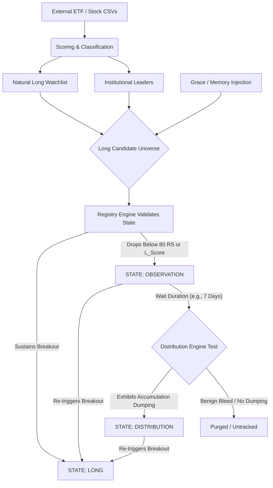

# TABELA Data Flow & Stock Lifecycle Architecture

> **Purpose:** This document maps the authoritative flow of a stock candidate throughout the TABELA Market Intelligence Platform. It outlines the precise triggers for promotion, grace persistence, demotion, structural tracking, and ultimate eviction from the system.

## 1. System Data Flow Diagram

## 2. Definitive Lifecycle Breakdown

### Phase 1: Entry into LONG
A stock enters the `LONG` tracking state organically by qualifying as a top-tier candidate on any given trading day.
* **Via Natural List:** It must belong to a `Leading` or `Unclassified Leader` theme, and possess structural baseline strength (`RS_Rating >= 90`, `Long_Score >= 85`).
* **Via Institutional Elite:** It must strictly belong to a `Leading` theme and boast ultra-premium metrics (`Composite_Score >= 90` OR `RS_Rating >= 95`).
* *Action:* TABELA writes the stock into `registry.json` as `"LONG"`.

### Phase 2: Sustaining LONG (The Grace Period)
Because highly-ranked stocks experience temporary daily pullbacks (e.g., a Leading theme drifting to Neutral for two days), TABELA implements a **Grace Leniency** to prevent rapid flickering.
* **The Mechanism:** When a previously-LONG stock falls out of the natural generation lists, the Transition Engine checks a fallback threshold before discarding it.
* **The Rule:** If the stock's `Long_Score >= 80` AND its `RS_Rating >= 80`, it is granted an extension. It is allowed to stay in the `LONG` state within the registry.
* **The Output Injection:** The `core/pipeline.py` script automatically scoops up any stock in the registry with a `"LONG"` stamp and aggressively injects it back into the daily presentation report—regardless of its current Theme limitations. 

### Phase 3: Demotion to OBSERVATION
When a stock's baseline structure genuinely breaks down, patience runs out.
* **The Trigger:** Inside the Transition Engine, if *either* the `Long_Score` collapses below `80` OR the `RS_Rating` drops below `80`, the stock violently fails its grace check.
* **The Action:** The engine revokes its `"LONG"` identity and overwrites its registry state to `"OBSERVATION"`, starting a countdown clock (`state_days = 1`).
* **Reporting:** The stock exits the Long Candidates screen and populates the "Stock Transitions" report under "Observation (Day 1)".

### Phase 4: Navigating OBSERVATION
Observation serves as an analytical waiting room (a purgatory) to determine if a pullback was merely a shakeout or the start of institutional distribution.
* **The Timeline:** A stock typically resides in Observation pending exactly 7 runs (`OBSERVATION_MAX_RUNS`). 
* **Recovery Route:** If the stock structurally repairs itself and breaks back into the natural Long watchlists on Day 3, it is instantly designated as a `Recovering Leader`. Its Observation memory is wiped, and it is promoted back to `"LONG"` Phase 1. 

### Phase 5: Distribution vs. Eviction
When the Observation clock expires (hitting Day 8), TABELA makes a definitive binary decision about the stock's future. 

**Path A: DISTRIBUTION**
* **The Test:** On the deadline execution day, the Distribution Engine takes a snapshot of the stock's recent trend lines (e.g., looking for negative gaps, deteriorating relative strength deltas, momentum weakness).
* **The Trigger:** If the metrics match severe institutional liquidation, the stock earns the `"DISTRIBUTION"` label in the registry. It will now continuously populate the Distribution Watchlist.

**Path B: PURGE / UNTRACKED**
* **The Action:** If the expiring Observation stock exhibits benign drifting rather than active institutional dumping, it fails the distribution test. 
* **The Ghosting Protocol:** TABELA simply deletes the tracking record natively: `del registry[ticker]`. The stock vanishes entirely from the platform's daily output until it organically breaks out into Phase 1 again on a later date.

### Edge Case: Ghost Purge
* If a stock undergoes a corporate merger, de-listing, or ticker change and physically vanishes from the daily Zacks `_stocks.csv` snapshot, TABELA's cross-check validation will flag the stock as a "Ghost" and instantly purge its tracking memory across all states.
